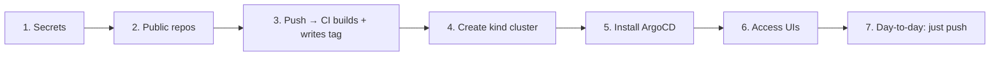

# HowTo — Bring product-app up from scratch

This is the first-time setup guide. It takes you from an empty machine to a
running cluster where pushing code auto-deploys through GitHub Actions + ArgoCD.

**Mental model:** the cluster pulls images from Docker Hub, so CI must build and
push them **before** ArgoCD can deploy. The order below respects that.



---

## Prerequisites

Install and verify:

```bash
docker --version          # container build/run
kind version              # local Kubernetes
kubectl version --client
helm version
```

You also need a **GitHub** account (the repo) and a **Docker Hub** account (the
registry). The repo `https://github.com/princewillopah/product-app.git` is
**public**, so ArgoCD needs no Git credentials.

---

## Step 1 — Add Docker Hub credentials to GitHub

CI authenticates to Docker Hub with two **GitHub repository secrets** (encrypted;
never printed in logs). Create a Docker Hub access token first:

1. Docker Hub → **Account Settings → Personal access tokens → Generate new token**.
2. Name it `github-actions`, scope **Read & Write**, copy it (shown once).

Then in GitHub → **Settings → Secrets and variables → Actions → New repository
secret**, add:

| Secret | Value |
|--------|-------|
| `DOCKERHUB_USERNAME` | `princewillopah` |
| `DOCKERHUB_TOKEN` | the access token from above (paste it directly into GitHub) |

> Never paste the token into chat, a file, or a commit. It lives only in GitHub
> secrets.

---

## Step 2 — Make the Docker Hub repos public

`kind` has no image-pull secret, so ArgoCD-synced pods can only pull from
**public** repositories. On the first CI push the five repos are auto-created as
**private** — flip each to public (Docker Hub → repo → Settings → Make public):

```
product-app-order-service
product-app-analytics-service
product-app-product-service
product-app-api-gateway
product-app-frontend
```

---

## Step 3 — Push code so CI builds the images

```bash
cd /home/princewillopah/DevOps/product-app
git add -A
git commit -m "ci: trigger image build"   # or push any change under images/**
git push origin main
```

Watch it at `https://github.com/princewillopah/product-app/actions`. On a green
run the pipeline:

1. builds all **five** images in parallel and pushes them to Docker Hub with tags
   `latest`, `main`, `main-<sha>`, and the immutable `<sha>`;
2. runs `helm lint` + `helm template` on both charts and `yamllint` on the ArgoCD
   manifests;
3. writes the 7-char `<sha>` into `charts/product-app/values.yaml`
   (`global.image.tag`) and commits it with `[skip ci]`.

**Wait for the run to go green before continuing** — Step 5 deploys those exact
image tags.

> Until the secrets in Step 1 exist, this run fails at the Docker Hub login step.
> That is the only manual gate in the whole system.

---

## Step 4 — Create the local kind cluster

```bash
bash scripts/setup-kind-dev.sh
```

This creates the 3-node `product-app-dev` cluster (1 control-plane + 2 workers),
maps NodePorts to `localhost`, and installs `metrics-server` (needed for HPAs).

---

## Step 5 — Install ArgoCD and bootstrap GitOps

```bash
bash scripts/setup-argocd.sh
```

This Helm-installs ArgoCD into the `argocd` namespace, then applies:

- `k8s/argocd/appproject.yaml` — the `product-app` AppProject (security guardrail), and
- `argocd-apps/applicationset-multi-cluster.yaml` — two ApplicationSets that
  generate the Applications `product-app-services-dev` (from `charts/product-app`)
  and `product-app-observability-dev` (from `charts/observability`).

ArgoCD clones the public repo, renders the charts, and syncs both namespaces
automatically. Watch them reach `Synced / Healthy`:

```bash
kubectl -n argocd get applications
kubectl get pods -n product-app
kubectl get pods -n observability-stack
```

---

## Step 6 — Access the UIs

NodePort services are already mapped to `localhost`:

| UI | URL | Credentials |
|----|-----|-------------|
| Frontend (admin dashboard) | http://localhost:8080 | — |
| Storefront | http://localhost:8080/shop | — |
| API Gateway | http://localhost:8000 | — |
| Prometheus | http://localhost:9090 | — |
| Grafana | http://localhost:3000 | `admin` / `prom-operator` |
| Alertmanager | http://localhost:9093 | — |

ArgoCD, Loki and Tempo are `ClusterIP`; port-forward them:

```bash
# ArgoCD → https://localhost:8089  (user: admin)
kubectl -n argocd port-forward svc/argocd-server 8089:443
kubectl -n argocd get secret argocd-initial-admin-secret \
  -o jsonpath='{.data.password}' | base64 -d && echo

# Loki / Tempo
kubectl -n observability-stack port-forward svc/loki 3100:3100
kubectl -n observability-stack port-forward svc/tempo 3200:3200
```

> Rotate the initial ArgoCD admin password after first login, then delete the
> `argocd-initial-admin-secret`.

---

## Step 7 — Validate

```bash
bash scripts/validate-observability.sh   # metrics / logs / traces checks
bash scripts/test-endpoints.sh           # service endpoint smoke test
bash scripts/generate-traffic.sh         # optional: synthetic load for dashboards
```

Then open Grafana and confirm metrics, logs (Loki) and traces (Tempo) are
flowing.

---

## Day-to-day: what happens on every code change

```
edit code → git push (images/**)
   → GitHub Actions builds & pushes 5 images to Docker Hub
   → CI writes global.image.tag=<sha> back to Git [skip ci]
   → ArgoCD detects the commit, pulls :<sha>, syncs the cluster
   → Prometheus scrapes, Grafana shows, alerts route if SLOs break
```

You do **not** run `kubectl apply` or `helm install` for app changes. To roll
back, `git revert` the tag-bump commit and let ArgoCD sync.

---

## Order-of-operations cheat sheet

| # | Action | Prerequisite |
|---|--------|--------------|
| 1 | Add `DOCKERHUB_USERNAME` + `DOCKERHUB_TOKEN` secrets | Docker Hub token created |
| 2 | Make the 5 Docker Hub repos public | First CI push (repos auto-created) |
| 3 | `git push` → wait for green CI | Secrets set |
| 4 | `bash scripts/setup-kind-dev.sh` | docker + kind installed |
| 5 | `bash scripts/setup-argocd.sh` | Step 4 done |
| 6 | Open the UIs | Step 5 synced |
| 7 | `bash scripts/validate-observability.sh` | Step 6 healthy |

If you get stuck, note the step number and the exact error — that's enough to
diagnose it.
