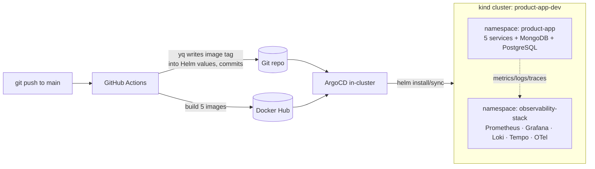
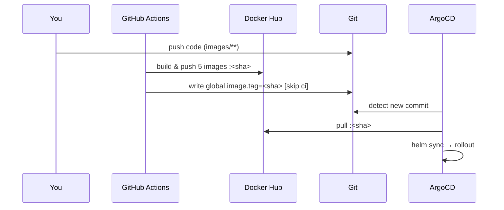

# product-app — GitOps Microservices with Full-Stack Observability

A demo-grade but production-patterned platform: five microservices built and
shipped by **GitHub Actions**, deployed to **Kubernetes** by **ArgoCD** from
**Helm** charts, and observed end-to-end with **Prometheus, Grafana, Loki, Tempo
and the OpenTelemetry Collector**.

| | |
|---|---|
| **Container registry** | Docker Hub — `docker.io/princewillopah/product-app-<service>` |
| **CI** | GitHub Actions (`.github/workflows/build-images.yml`) |
| **CD** | ArgoCD (pull-based GitOps) |
| **Packaging** | Helm (`charts/product-app`, `charts/observability`) |
| **Local target** | a single 3-node `kind` cluster (`product-app-dev`) |

> This repo runs on one local `kind` cluster. The ArgoCD `ApplicationSet`s are
> written so that adding real `staging`/`prod` clusters later is a few
> uncommented lines — see [Multi-cluster](#multi-cluster-extension-point).

---

## Architecture



**The flow in one sentence:** you push code → CI builds and pushes five images
to Docker Hub and writes the new image tag back into Git → ArgoCD sees the Git
change and syncs the cluster to match. CI never touches the cluster; ArgoCD
never touches the registry credentials.

---

## Services

| Service | Language | Role | In-cluster URL |
|---------|----------|------|----------------|
| `api-gateway` | Node.js | Public entrypoint, fans out to the others | `api-gateway.product-app:8080` |
| `order-service` | Go | Orders, writes to MongoDB | `order-service.product-app:8080` |
| `product-service` | Java (Spring) | Product catalog, writes to PostgreSQL | `product-service.product-app:8080` |
| `analytics-service` | Python (FastAPI) | Aggregates order/product data | `analytics-service.product-app:8080` |
| `frontend` | React + TS (Vite/Tailwind) via nginx | Admin dashboard + `/shop` storefront | `frontend.product-app:8080` |

Datastores (`MongoDB`, `PostgreSQL`) are pulled in as Helm chart dependencies of
`charts/product-app` and run in-cluster.

---

## Repository layout

```
product-app/
├── .github/workflows/
│   └── build-images.yml          # CI: build 5 images → Docker Hub, write tag back to Git
│
├── images/                       # one build context per service
│   ├── order-service/            #   Go      (go.mod, main.go)
│   ├── analytics-service/        #   Python  (main.py, requirements.txt)
│   ├── product-service/          #   Java    (pom.xml, src/)
│   ├── api-gateway/              #   Node    (server.js, package.json)
│   └── frontend/                 #   React+TS (Vite) served by nginx
│
├── charts/
│   ├── product-app/              # generic templates driven by values.yaml `services:` map
│   │   ├── templates/            #   deployment, service, hpa, pdb, rbac, serviceaccount, configmap
│   │   ├── charts/               #   vendored deps: mongodb, postgresql (.tgz)
│   │   └── values.yaml           #   global.image.tag is what CI rewrites
│   └── observability/            # kube-prometheus-stack + loki + tempo + opentelemetry-collector
│       └── charts/               #   vendored deps (.tgz)
│
├── argocd-apps/
│   └── applicationset-multi-cluster.yaml   # 2 ApplicationSets: services + observability
│
├── k8s/
│   └── argocd/appproject.yaml    # ArgoCD AppProject (security guardrail)
│
├── scripts/
│   ├── setup-kind-dev.sh         # create the local kind cluster (+ metrics-server)
│   ├── setup-argocd.sh           # install ArgoCD, apply AppProject + ApplicationSets
│   ├── generate-traffic.sh       # synthetic load for the dashboards
│   ├── test-endpoints.sh         # quick endpoint smoke test
│   ├── validate-observability.sh # metrics/logs/traces checks
│   └── verify-observability.py   # deeper observability assertions
│
└── docs/
    ├── RUNBOOK.md                # day-2 operations & incident response
    └── github-action-pipeline.md # line-by-line walkthrough of CI + ArgoCD
```

There is **no Kustomize and no GHCR** in this repo — deployment is Helm-only and
the registry is Docker Hub. (Both were removed; see the Git history.)

---

## Quick start (local)

### Prerequisites

`docker`, `kind`, `kubectl`, `helm`, and a Docker Hub account. Verify:

```bash
docker --version && kind version && kubectl version --client && helm version
```

### 1. One-time: make CI able to push images

The cluster pulls images from Docker Hub, so CI has to push them there first.
Add two **repository secrets** in GitHub (Settings → Secrets and variables →
Actions):

| Secret | Value |
|--------|-------|
| `DOCKERHUB_USERNAME` | `princewillopah` |
| `DOCKERHUB_TOKEN` | a Docker Hub **access token** (Account Settings → Personal access tokens → Read/Write) |

Then make the five Docker Hub repos **public** (`product-app-order-service`,
`product-app-analytics-service`, `product-app-product-service`,
`product-app-api-gateway`, `product-app-frontend`) — `kind` has no image-pull
secret, so private repos would fail with `ImagePullBackOff`.

### 2. Trigger CI

Push any change under `images/**` (or run the workflow manually from the Actions
tab). On a green run CI will:

1. build and push all five images to Docker Hub, and
2. commit the new 7-char image tag into `charts/product-app/values.yaml`
   (`global.image.tag`) with `[skip ci]`.

### 3. Create the cluster and bootstrap GitOps

```bash
bash scripts/setup-kind-dev.sh    # 3-node kind cluster + metrics-server
bash scripts/setup-argocd.sh      # installs ArgoCD, applies AppProject + ApplicationSets
```

ArgoCD then clones this **public** repo (no repo credentials needed), renders the
Helm charts, and syncs both namespaces automatically.

### 4. Access the UIs

NodePort services are mapped to `localhost` by the kind config:

| UI | URL | Credentials |
|----|-----|-------------|
| Frontend (admin dashboard) | http://localhost:8080 | — |
| Storefront | http://localhost:8080/shop | — |
| API Gateway | http://localhost:8000 | — |
| Prometheus | http://localhost:9090 | — |
| Grafana | http://localhost:3000 | `admin` / `prom-operator` |
| Alertmanager | http://localhost:9093 | — |

ArgoCD, Loki and Tempo are `ClusterIP` — reach them with a port-forward:

```bash
# ArgoCD UI  → https://localhost:8089  (user: admin)
kubectl -n argocd port-forward svc/argocd-server 8089:443
kubectl -n argocd get secret argocd-initial-admin-secret \
  -o jsonpath='{.data.password}' | base64 -d && echo   # initial admin password

# Loki / Tempo
kubectl -n observability-stack port-forward svc/loki 3100:3100
kubectl -n observability-stack port-forward svc/tempo 3200:3200
```

---

## Day-to-day workflow



You never run `kubectl apply` or `helm install` by hand for app changes — edit
code, push, and let CI + ArgoCD do the rest. To roll back, `git revert` the
tag-bump commit; ArgoCD syncs the cluster back.

---

## Observability

- **Metrics** — `kube-prometheus-stack` (Prometheus Operator + Grafana +
  Alertmanager + node-exporter). Services are discovered by Prometheus pod
  annotations (`prometheus.io/scrape`).
- **Logs** — Loki, queried in Grafana via the Loki datasource.
- **Traces** — services export OTLP to the **OpenTelemetry Collector**
  (`otel-collector.observability-stack:4317`), which forwards to **Tempo**.
- **Dashboards & alerts** — shipped by the `observability` chart; Grafana has
  Prometheus, Loki and Tempo datasources wired in.

Everything above is deployed by ArgoCD from `charts/observability`. Validate it
with `bash scripts/validate-observability.sh`.

---

## Multi-cluster extension point

[`argocd-apps/applicationset-multi-cluster.yaml`](argocd-apps/applicationset-multi-cluster.yaml)
already generates one `Application` per cluster from a list generator. Today only
`dev` is active (`https://kubernetes.default.svc` — the kind cluster ArgoCD runs
in). The `staging`/`prod` entries are intentionally commented out: uncomment them
**after** you register a real cluster with `argocd cluster add <context>`, and add
per-environment overlays as `charts/product-app/values-<env>.yaml`. Until a
cluster is registered, leaving them commented prevents `cluster not found` sync
errors.

---

## Documentation

| Document | Purpose |
|----------|---------|
| [docs/github-action-pipeline.md](docs/github-action-pipeline.md) | Line-by-line walkthrough of the CI pipeline and ArgoCD GitOps |
| [docs/RUNBOOK.md](docs/RUNBOOK.md) | Day-2 operations, troubleshooting, scaling, rollback |
| [HowTo.md](HowTo.md) | First-time bring-up, step by step |
