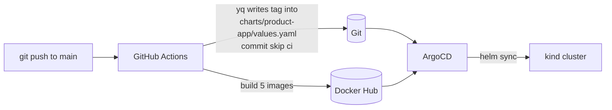
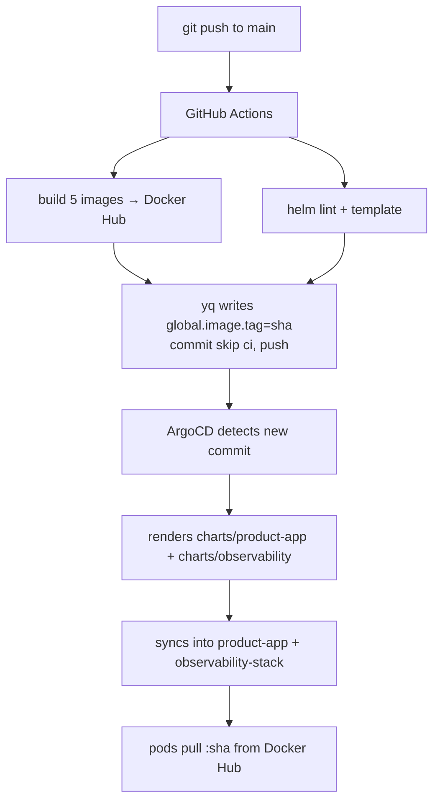

# The CI/CD Pipeline & GitOps — line by line

This is a teaching walkthrough of how a `git push` becomes a running deployment.
Two halves:

1. **CI** — `.github/workflows/build-images.yml` builds images and writes the new
   image tag back into Git.
2. **CD (GitOps)** — ArgoCD watches Git and makes the cluster match it.

The key property: **CI never talks to the cluster, and the cluster never holds
registry push credentials.** Git is the hand-off point between them.



---

# Part 1 — The pipeline (`build-images.yml`)

## Triggers

```yaml
on:
  push:
    branches: [main]
    paths:
      - 'images/**'
      - '.github/workflows/build-images.yml'
      # NOTE: 'charts/**' is deliberately NOT here.
  workflow_dispatch:
```

- Runs only on `main`, and only when something under `images/**` or the workflow
  file changes (editing a README won't burn build minutes).
- **`charts/**` is intentionally excluded.** The pipeline *writes* to
  `charts/product-app/values.yaml` at the end; if `charts/**` were a trigger, that
  write would retrigger the pipeline forever. The tag-bump commit also carries
  `[skip ci]` as a second guard.
- `workflow_dispatch` adds a manual **Run workflow** button.

## Environment

```yaml
env:
  REGISTRY: docker.io
  IMAGE_NAMESPACE: ${{ secrets.DOCKERHUB_USERNAME }}
  IMAGE_PREFIX: product-app-
```

Images are named `docker.io/<DOCKERHUB_USERNAME>/product-app-<service>`. The
username comes from a **GitHub secret**, so nothing identity-specific is
hard-coded. The registry is **Docker Hub** (not GHCR).

## Job 1 — `build-matrix` (build & push)

```yaml
jobs:
  build-matrix:
    runs-on: ubuntu-latest
    strategy:
      fail-fast: false
      matrix:
        service:
          - order-service
          - analytics-service
          - product-service
          - api-gateway
          - frontend
    permissions:
      contents: read
```

- The **matrix** runs this job once per service — **five** builds in parallel
  (the `frontend` is included so the storefront/admin UI ships through CI like
  everything else).
- `fail-fast: false` — one service failing doesn't cancel the others.
- `contents: read` — least privilege; this job only reads the repo.

The steps inside each parallel copy:

```yaml
- uses: actions/checkout@v4
  with: { fetch-depth: 0 }
- uses: docker/setup-buildx-action@v3
- uses: docker/login-action@v3
  with:
    registry: ${{ env.REGISTRY }}
    username: ${{ secrets.DOCKERHUB_USERNAME }}
    password: ${{ secrets.DOCKERHUB_TOKEN }}
```

- `checkout` clones the repo (full history; `fetch-depth: 0`).
- `setup-buildx` enables BuildKit (layer caching, multi-platform).
- `login-action` authenticates to Docker Hub. `DOCKERHUB_TOKEN` is a Docker Hub
  **access token**, not your password. **If these two secrets are missing, this
  is the step that fails and turns the run red.**

```yaml
- id: meta
  uses: docker/metadata-action@v5
  with:
    images: ${{ env.REGISTRY }}/${{ env.IMAGE_NAMESPACE }}/${{ env.IMAGE_PREFIX }}${{ matrix.service }}
    tags: |
      type=ref,event=branch
      type=sha,prefix={{branch}}-
      type=sha,prefix=
      type=raw,value=latest,enable={{is_default_branch}}
```

This computes the tag set for each image:

| Recipe | Produces | Purpose |
|--------|----------|---------|
| `type=ref,event=branch` | `main` | human-friendly branch tag |
| `type=sha,prefix={{branch}}-` | `main-abc1234` | branch + commit |
| `type=sha,prefix=` | `abc1234` | **the immutable 7-char tag GitOps uses** |
| `type=raw,value=latest` (main only) | `latest` | convenience |

The bare `<sha>` tag is the important one — it's immutable, so a given tag always
means exactly one image, which is what makes rollbacks reliable.

```yaml
- uses: docker/build-push-action@v5
  with:
    context: ./images/${{ matrix.service }}
    file: ./images/${{ matrix.service }}/Dockerfile
    push: true
    tags: ${{ steps.meta.outputs.tags }}
    cache-from: type=gha
    cache-to: type=gha,mode=max
```

Builds from the service's own folder and pushes every computed tag. `type=gha`
caches Docker layers in GitHub Actions cache so unchanged layers aren't rebuilt.

## Job 2 — `validate` (lint the charts)

```yaml
validate:
  needs: build-matrix
  steps:
    - uses: actions/checkout@v4
    - uses: azure/setup-helm@v4
      with: { version: v3.16.4 }
    - run: |
        for chart in charts/product-app charts/observability; do
          helm lint "$chart"
          helm template release "$chart" >/dev/null
        done
    - run: |
        sudo apt-get update && sudo apt-get install -y yamllint
        yamllint -d '{...}' argocd-apps/*.yaml k8s/argocd/appproject.yaml
```

- `needs: build-matrix` — waits for all five builds.
- **`helm lint`** catches chart mistakes; **`helm template … >/dev/null`** is a
  render smoke test — if any template produces invalid YAML or a bad value
  reference, this fails before anything reaches the cluster. Chart dependencies
  are **vendored** (`charts/*/charts/*.tgz` committed to Git), so this runs fully
  offline — no `helm repo add`, no network.
- `yamllint` checks the ArgoCD manifests and the AppProject. (It deliberately
  does **not** lint the Helm templates — those contain `{{ }}` and aren't valid
  standalone YAML.)

> This replaced an older `kubeval` step. `kubeval`'s action is archived and it
> validated raw `k8s/` manifests that no longer exist now that everything is Helm.

## Job 3 — `update-manifests` (the GitOps write-back)

This is the heart of the pull-based model.

```yaml
update-manifests:
  needs: [build-matrix, validate]
  if: github.ref == 'refs/heads/main'
  permissions:
    contents: write          # lets GITHUB_TOKEN push the tag-bump commit
  steps:
    - uses: actions/checkout@v4
      with: { ref: ${{ github.ref_name }} }
    - id: tag
      run: echo "sha=${GITHUB_SHA::7}" >> "$GITHUB_OUTPUT"
    - run: |
        yq -i ".global.image.tag = \"${{ steps.tag.outputs.sha }}\"" charts/product-app/values.yaml
    - run: |
        git config user.name  "github-actions[bot]"
        git config user.email "41898282+github-actions[bot]@users.noreply.github.com"
        git diff --quiet -- charts/product-app/values.yaml && { echo "no change"; exit 0; }
        git add charts/product-app/values.yaml
        git commit -m "chore(deploy): release ${{ steps.tag.outputs.sha }} [skip ci]"
        git push
```

- Runs only on `main`, only after builds + lint pass.
- `contents: write` lets the built-in `GITHUB_TOKEN` push. (Pushes made with
  `GITHUB_TOKEN` don't retrigger workflows — a second loop guard on top of
  `[skip ci]` and the `paths` filter.)
- `${GITHUB_SHA::7}` is the same 7-char short SHA `docker/metadata-action`
  produced, so the tag written here exactly matches a pushed image.
- **`yq`** sets `global.image.tag` in `charts/product-app/values.yaml` — the one
  file ArgoCD reads. Because all five services inherit `global.image.tag` (no
  per-service tag overrides), this single line version-bumps the whole app in
  lockstep.
- The commit lands in Git; ArgoCD takes it from here.

> **Why write to Git instead of `kubectl set image`?** So CI needs **zero**
> cluster credentials, the deployed version is auditable in Git history, and
> rollback is just `git revert`.

## Job 4 — `summary`

```yaml
summary:
  needs: [build-matrix, validate, update-manifests]
  if: always()
```

`if: always()` runs it even if an earlier job failed, so you always get a result
summary in the Actions tab.

---

# Part 2 — GitOps with ArgoCD

**The idea:** instead of *you* running `kubectl`/`helm`, ArgoCD runs **inside**
the cluster, watches this Git repo, and continuously makes the cluster match it.
Change Git → ArgoCD changes the cluster. Three pieces.

## A — AppProject (the guardrail)

File: `k8s/argocd/appproject.yaml`

An `AppProject` answers "what are these apps allowed to do?" — it whitelists the
source repo and the destination namespaces (`product-app`, `observability-stack`,
`argocd`). An app in this project can't deploy from a random repo or into
`kube-system`. It's a security boundary, not a deployment.

## B — ApplicationSet (the factory)

File: `argocd-apps/applicationset-multi-cluster.yaml`

An **Application** = "deploy this Git path into this cluster/namespace." An
**ApplicationSet** is a factory that generates Applications from a list. There are
two — one for services, one for observability.

```yaml
spec:
  goTemplate: true
  generators:
    - list:
        elements:
          - cluster: dev
            environment: development
            url: https://kubernetes.default.svc   # the kind cluster ArgoCD runs in
            namespace: product-app
          # staging / prod are commented out until a real cluster is registered
          # with `argocd cluster add`, otherwise sync errors "cluster not found".
```

> Earlier versions used placeholder URLs like `https://dev-cluster:6443` that
> pointed at clusters that didn't exist, so nothing deployed. That's fixed: `dev`
> now targets `https://kubernetes.default.svc` (the local cluster), and the unreal
> environments are commented out rather than left as broken placeholders.

```yaml
  template:
    metadata:
      name: "product-app-services-{{ .cluster }}"   # → product-app-services-dev
    spec:
      project: product-app
      source:
        repoURL: https://github.com/princewillopah/product-app.git
        targetRevision: main
        path: charts/product-app          # ← Helm chart, NOT a raw manifest folder
        helm:
          releaseName: product-app
          valueFiles: [values.yaml]
      destination:
        server: "{{ .url }}"
        namespace: "{{ .namespace }}"
      syncPolicy:
        automated: { prune: true, selfHeal: true, allowEmpty: false }
        syncOptions: [CreateNamespace=true, PruneLast=true]
        retry: { limit: 5, backoff: { duration: 5s, factor: 2, maxDuration: 3m } }
```

The important fields:

- **`path: charts/product-app` + `helm:`** — ArgoCD renders the Helm chart (this
  is what reads the `global.image.tag` that CI wrote). The second ApplicationSet
  is identical but with `path: charts/observability`,
  `namespace: observability-stack`, and one extra sync option,
  **`ServerSideApply=true`** (kube-prometheus-stack's CRDs exceed the client-side
  apply annotation size limit, so server-side apply is required).
- **`automated.prune`** — delete from the cluster what you delete from Git.
- **`automated.selfHeal`** — revert manual `kubectl` drift back to Git. The
  cluster cannot diverge from the repo.
- **`allowEmpty: false`** — refuse to sync down to zero resources (anti-footgun).
- **`CreateNamespace=true`** — ArgoCD creates `product-app` /
  `observability-stack` itself, which is why there's no `namespaces.yaml`.
- **`retry`** — exponential backoff handles transient cases (e.g. an image still
  propagating in the registry).

This generates exactly two Applications today: `product-app-services-dev` and
`product-app-observability-dev`.

## C — `setup-argocd.sh` (the installer)

File: `scripts/setup-argocd.sh`. Not config — the bootstrap. It Helm-installs
ArgoCD into the `argocd` namespace, then `kubectl apply`s the AppProject (A) and
the ApplicationSets (B). Because the repo is public, ArgoCD needs no Git
credentials.

---

# The full loop



- **CI** = Continuous Integration: build + lint + write the tag.
- **ArgoCD** = Continuous Delivery: detect + render + sync.
- **AppProject** = guardrail · **ApplicationSet** = factory · generated
  **Applications** = the actual deploy units.

---

# Prerequisites for the loop to be green

1. **GitHub secrets** `DOCKERHUB_USERNAME` and `DOCKERHUB_TOKEN` set — without
   them the build job fails at Docker Hub login.
2. **Docker Hub repos public** — `kind` has no pull secret, so private repos give
   `ImagePullBackOff` after ArgoCD syncs.
3. **CI has run once on `main`** so the `<sha>`-tagged images exist before ArgoCD
   tries to pull them.

With those in place, every push deploys itself. See [../HowTo.md](../HowTo.md) for
the first-time setup and [RUNBOOK.md](RUNBOOK.md) for day-2 operations.
