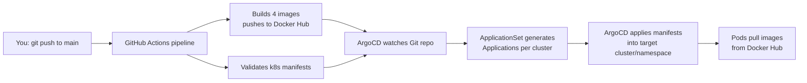

**Your ArgoCD ApplicationSets point at clusters that don't exist yet.** Look at lines like `url: https://dev-cluster:6443` — those are placeholder hostnames. Right now ArgoCD only knows about the local cluster (`https://kubernetes.default.svc`). So even though the ApplicationSets are *installed*, they are not deploying anything because they can't reach `dev-cluster`, `staging-cluster`, or `prod-cluster`. I'll show you exactly where this matters and how to fix it at the end. [certain]

Now the line-by-line teaching.

---

# PART 1 — The Pipeline (GitHub Actions)

File: build-images.yml

A GitHub Actions pipeline is a YAML file that runs automation on GitHub's servers when something happens in your repo (like a `git push`). Let's walk it.

## Header & triggers

```yaml
name: Build & Push Images to Docker Hub
```
Just a human-readable name shown in the GitHub "Actions" tab.

```yaml
on:
  push:
    branches:
      - main
    paths:
      - 'images/**'
      - '.github/workflows/build-images.yml'
      - 'k8s/**'
  workflow_dispatch:
```
- `on:` = "what events start this pipeline."
- `push:` + `branches: [main]` = run only when commits land on the `main` branch.
- `paths:` = an **optimization**. Only run if the push changed files under `images/`, the workflow file itself, or `k8s/`. If you only edit a README, the pipeline is skipped (saves build minutes).
- `workflow_dispatch:` = adds a manual "Run workflow" button in the UI.

## Environment variables

```yaml
env:
  REGISTRY: docker.io
  IMAGE_NAMESPACE: ${{ secrets.DOCKERHUB_USERNAME }}
  IMAGE_PREFIX: product-app-
```
- `env:` = variables available to every job below.
- `REGISTRY: docker.io` = Docker Hub's address.
- `${{ secrets.DOCKERHUB_USERNAME }}` = pulls a value from **GitHub repo secrets** (Settings → Secrets → Actions). Secrets are encrypted; they never print in logs. This is why your username isn't hard-coded.
- `IMAGE_PREFIX: product-app-` = the naming convention you asked for, so images become `product-app-order-service`, etc.

The `${{ ... }}` syntax is GitHub Actions' expression/template language — anything inside gets substituted at runtime.

## The build job

```yaml
jobs:
  build-matrix:
    name: Build ${{ matrix.service }}
    runs-on: ubuntu-latest
```
- `jobs:` = a pipeline is made of one or more jobs. Jobs run in parallel by default.
- `runs-on: ubuntu-latest` = GitHub spins up a fresh Ubuntu virtual machine for this job. It's thrown away when the job ends.

```yaml
    strategy:
      fail-fast: false
      matrix:
        service:
          - order-service
          - analytics-service
          - product-service
          - api-gateway
```
This is the **matrix** — the most important concept here. It tells GitHub: "run this job 4 times in parallel, once per value." So you get 4 simultaneous builds, one per service. `${{ matrix.service }}` becomes `order-service` in copy 1, `analytics-service` in copy 2, etc.

- `fail-fast: false` = if `order-service` fails to build, **don't** cancel the other 3. Without this, one failure kills all siblings.

```yaml
    permissions:
      contents: read
```
Least-privilege security: this job's GitHub token can only *read* the repo, nothing else.

## The steps (run top-to-bottom inside each matrix copy)

```yaml
      - name: Checkout repository
        uses: actions/checkout@v4
        with:
          fetch-depth: 0
```
- `uses:` = run a pre-built, reusable action published by someone else. `actions/checkout@v4` is GitHub's official "git clone my repo onto this VM" action.
- `fetch-depth: 0` = clone the **full** git history (default is just the latest commit). Needed if any tooling reads tags/commit history.

```yaml
      - name: Set up Docker Buildx
        uses: docker/setup-buildx-action@v3
```
Installs **Buildx**, Docker's advanced builder. It enables build caching and multi-platform builds (amd64 + arm64).

```yaml
      - name: Log in to Docker Hub
        uses: docker/login-action@v3
        with:
          registry: ${{ env.REGISTRY }}
          username: ${{ secrets.DOCKERHUB_USERNAME }}
          password: ${{ secrets.DOCKERHUB_TOKEN }}
```
Authenticates the VM to Docker Hub so it can push images. `DOCKERHUB_TOKEN` is an **access token** (not your real password) you generate at Docker Hub → Account Settings → Security. Both come from secrets.

```yaml
      - name: Extract metadata
        id: meta
        uses: docker/metadata-action@v5
        with:
          images: ${{ env.REGISTRY }}/${{ env.IMAGE_NAMESPACE }}/${{ env.IMAGE_PREFIX }}${{ matrix.service }}
          tags: |
            type=ref,event=branch
            type=sha,prefix={{branch}}-
            type=sha,prefix=
            type=raw,value=latest,enable={{is_default_branch}}
```
- `id: meta` = gives this step a name so later steps can read its outputs via `steps.meta.outputs....`
- `images:` = the full image name, assembled from the env vars → `docker.io/<youruser>/product-app-order-service`.
- `tags:` = a recipe for which tags to generate:
  - `type=ref,event=branch` → tag = branch name (`main`)
  - `type=sha,prefix={{branch}}-` → tag = `main-abc1234` (branch + commit SHA)
  - `type=sha,prefix=` → tag = `abc1234` (just the commit SHA — this is the **immutable** one)
  - `type=raw,value=latest,enable={{is_default_branch}}` → also tag `latest`, but only on `main`.

The commit-SHA tag is what makes rollbacks reliable. `latest` is convenient but ambiguous (it moves), which is the warning I raised earlier.

```yaml
      - name: Build and push Docker image
        uses: docker/build-push-action@v5
        with:
          context: ./images/${{ matrix.service }}
          file: ./images/${{ matrix.service }}/Dockerfile
          push: true
          tags: ${{ steps.meta.outputs.tags }}
          labels: ${{ steps.meta.outputs.labels }}
          cache-from: type=gha
          cache-to: type=gha,mode=max
```
The actual build.
- `context:` = the folder Docker builds from (the service's own directory).
-  = which Dockerfile to use.
- `push: true` = after building, push to Docker Hub (vs. just building locally).
- `tags:` / `labels:` = consume the output from the `meta` step.
- `cache-from` / `cache-to: type=gha` = store/reuse Docker layer cache in **GitHub Actions cache**, so the next build reuses unchanged layers and runs much faster. `mode=max` caches all layers, not just the final ones.

```yaml
      - name: Log image build success
        run: |
          echo "✅ Built and pushed: ..."
```
- `run:` = execute raw shell commands (instead of a reusable `uses:` action). The `|` lets you write multiple lines. Pure logging for humans.

## The validate job

```yaml
  validate:
    name: Validate Kubernetes Manifests
    runs-on: ubuntu-latest
    needs: build-matrix
```
- `needs: build-matrix` = **dependency**. This job waits until all 4 matrix builds succeed before starting. This is how you order jobs (otherwise they'd run in parallel).

```yaml
      - name: Validate Kubernetes manifests
        uses: instrumenta/kubeval-action@master
        with:
          files: k8s/
          strict: true
```
Runs `kubeval`, which checks your YAML in `k8s/` against the Kubernetes schema — catches typos like a misspelled `replicas` before they ever reach a cluster. `strict: true` rejects unknown fields (exactly the kind of bug we hit with `fsGroup` in the wrong place).

```yaml
      - name: Lint YAML files
        run: |
          sudo apt-get install -y yamllint
          yamllint ... k8s/**/*.yaml ...
```
Installs and runs `yamllint` for style/formatting (indentation, line length). Catches sloppy YAML.

## The argocd-sync job

```yaml
  argocd-sync:
    needs: [build-matrix, validate]
    if: github.ref == 'refs/heads/main'
```
- `needs: [build-matrix, validate]` = waits for **both** prior jobs.
- `if:` = only run when the push is on `main`.

```yaml
        run: |
          curl -sSL -o argocd https://.../argocd-linux-amd64
          chmod +x argocd
          ./argocd app sync --all \
            --server "$ARGOCD_SERVER" \
            --auth-token "$ARGOCD_TOKEN" \
            --insecure
        continue-on-error: true
```
Downloads the ArgoCD CLI and tells ArgoCD "new images exist, sync now." `continue-on-error: true` = if ArgoCD is unreachable, don't fail the whole pipeline.

Note: this is **optional/push-based**. ArgoCD also polls Git on its own every ~3 minutes, so this step just makes syncs faster. It needs `ARGOCD_SERVER` and `ARGOCD_TOKEN` secrets, which you likely haven't set — that's fine, it's allowed to fail.

## The summary job

```yaml
  summary:
    needs: [build-matrix, validate]
    if: always()
```
- `if: always()` = run even if earlier jobs failed, so you always get a summary. Pure reporting.

---

# PART 2 — ArgoCD (GitOps)

**The core idea of GitOps:** instead of *you* running `kubectl apply`, ArgoCD runs **inside** the cluster, watches your Git repo, and continuously makes the cluster match what's in Git. Git becomes the single source of truth. You change Git → ArgoCD changes the cluster.

There are 3 files. Let me explain each.

## File A — AppProject

File: appproject.yaml

An `AppProject` is a **security boundary / guardrail**. It answers: "what is this group of apps *allowed* to do?"

```yaml
apiVersion: argoproj.io/v1alpha1
kind: AppProject
metadata:
  name: product-app
  namespace: argocd
```
- `kind: AppProject` = a custom resource ArgoCD installed (this is why it failed earlier before ArgoCD was installed — the `kind` didn't exist yet).
- Lives in the `argocd` namespace.

```yaml
spec:
  description: Product App multi-cluster deployments
  sourceRepos:
    - https://github.com/princewillopah/product-app.git
```
- `sourceRepos:` = a whitelist of Git repos apps in this project may pull from. Only your repo is allowed. If someone tried to deploy from a random repo, ArgoCD blocks it.

```yaml
  destinations:
    - server: '*'
      namespace: product-app
    - server: '*'
      namespace: observability-stack
    - server: '*'
      namespace: argocd
```
- `destinations:` = where apps may deploy. `server: '*'` = any cluster; `namespace:` = but only into these 3 namespaces. So this project can never accidentally deploy into `kube-system`.

```yaml
  clusterResourceWhitelist:
    - group: '*'
      kind: '*'
  namespaceResourceWhitelist:
    - group: '*'
      kind: '*'
```
- What **kinds** of Kubernetes objects are allowed. `'*'`/`'*'` = everything (Deployments, Services, ClusterRoles, etc.). In stricter setups you'd narrow this. For learning, wide-open is fine.

## File B — ApplicationSet

File: applicationset-multi-cluster.yaml

An **Application** in ArgoCD = "deploy this Git path into this cluster/namespace." An **ApplicationSet** is a *factory* that generates many Applications from a template. You have 2 ApplicationSets (services + observability). I'll explain the first; the second is identical in structure.

```yaml
apiVersion: argoproj.io/v1alpha1
kind: ApplicationSet
metadata:
  name: product-app-services-multi-cluster
  namespace: argocd
```
The factory object, named, living in `argocd`.

```yaml
spec:
  goTemplate: true
  syncPolicy:
    preserveResourcesOnDeletion: true
```
- `goTemplate: true` = use Go templating syntax `{{ .cluster }}` for substitution.
- `preserveResourcesOnDeletion: true` = if you delete the ApplicationSet, **don't** wipe the deployed workloads. A safety net.

```yaml
  generators:
    - list:
        elements:
          - cluster: dev
            environment: development
            url: https://dev-cluster:6443
            namespace: product-app
          - cluster: staging
            ...
          - cluster: prod
            ...
```
- `generators:` = "what data drives the factory." 
- `list:` = the simplest generator: a hand-written list. Here, 3 entries (dev/staging/prod). The factory will produce **one Application per entry** → 3 Applications.
- Each entry has variables (`cluster`, `environment`, `url`, `namespace`) that get plugged into the template below.

**⚠️ This is the gap I flagged:** `url: https://dev-cluster:6443` is a placeholder. For ArgoCD to deploy to a cluster, that exact `url` must be a registered cluster (via `argocd cluster add`). None of these are real, so these 3 Applications can't sync.

```yaml
  template:
    metadata:
      name: "product-app-services-{{ .cluster }}"
      namespace: argocd
      labels:
        cluster: "{{ .cluster }}"
        environment: "{{ .environment }}"
```
- `template:` = the blueprint for each generated Application. `{{ .cluster }}` is replaced per entry → produces `product-app-services-dev`, `product-app-services-staging`, `product-app-services-prod`.

```yaml
    spec:
      project: product-app
```
- Ties each generated Application back to the AppProject (File A) — inheriting its guardrails.

```yaml
      source:
        repoURL: https://github.com/princewillopah/product-app.git
        targetRevision: main
        path: k8s/services
        kustomize:
          nameSuffix: "-{{ .environment }}"
          commonLabels:
            environment: "{{ .environment }}"
            cluster: "{{ .cluster }}"
```
- `source:` = **where the YAML lives in Git.**
  - `repoURL` = your repo.
  - `targetRevision: main` = track the `main` branch.
  - `path: k8s/services` = deploy the manifests in that folder.
  - `kustomize:` = apply Kustomize transformations. `nameSuffix: "-development"` renames resources, and `commonLabels` stamps env/cluster labels on everything. This lets one folder serve all 3 environments with different names/labels.

```yaml
      destination:
        server: "{{ .url }}"
        namespace: "{{ .namespace }}"
```
- `destination:` = **where in Kubernetes it goes** — the cluster `url` and `namespace` from the generator entry.

```yaml
      syncPolicy:
        automated:
          prune: true
          selfHeal: true
          allowEmpty: false
```
This is the heart of GitOps automation:
- `prune: true` = if you delete a resource from Git, ArgoCD deletes it from the cluster.
- `selfHeal: true` = if someone manually `kubectl edit`s a live resource, ArgoCD reverts it back to match Git. The cluster can't drift.
- `allowEmpty: false` = refuse to sync if it would result in zero resources (guards against accidentally wiping everything).

```yaml
        syncOptions:
          - CreateNamespace=true
          - PruneLast=true
```
- `CreateNamespace=true` = auto-create the target namespace if missing.
- `PruneLast=true` = when pruning, delete old resources **after** applying new ones (safer ordering during updates).

```yaml
        retry:
          limit: 5
          backoff:
            duration: 5s
            factor: 2
            maxDuration: 3m
```
- If a sync fails, retry up to 5 times with **exponential backoff**: wait 5s, then 10s, then 20s... capped at 3 minutes. Handles transient failures (e.g., image not pushed yet).

The **second ApplicationSet** (`product-app-observability-multi-cluster`) is the same pattern but with `path: k8s/observability` and `namespace: observability-stack`. It manages your monitoring stack via GitOps instead of your app services.

## File C — setup-argocd.sh

File: setup-argocd.sh — this isn't ArgoCD config, it's the **installer**: it Helm-installs ArgoCD itself, then `kubectl apply`s Files A and B. That's the script you ran that printed "✅ ArgoCD installed."

---

# How they connect (the full loop)



- The **pipeline** builds images (CI = Continuous Integration).
- **ArgoCD** deploys them (CD = Continuous Delivery), driven by Git.
- The **AppProject** is the guardrail; the **ApplicationSet** is the factory; the generated **Applications** are the actual deploy units.

---

# The one thing to fix before this works end-to-end

Your generator `url`s are fake. For your **local dev cluster**, the simplest correct value is the in-cluster address. You'd either:

1. Change the dev entry's `url` to `https://kubernetes.default.svc` (deploy ArgoCD into the same cluster it runs in), **or**
2. Register real clusters with `argocd cluster add <context>` and use the URLs it reports.

Want me to rewrite the ApplicationSet so the **dev** entry targets your current local cluster (so you can actually watch ArgoCD deploy something), while keeping staging/prod as clearly-marked placeholders? That would turn this from "installed but idle" into "actually deploying." [likely the most useful next step]

